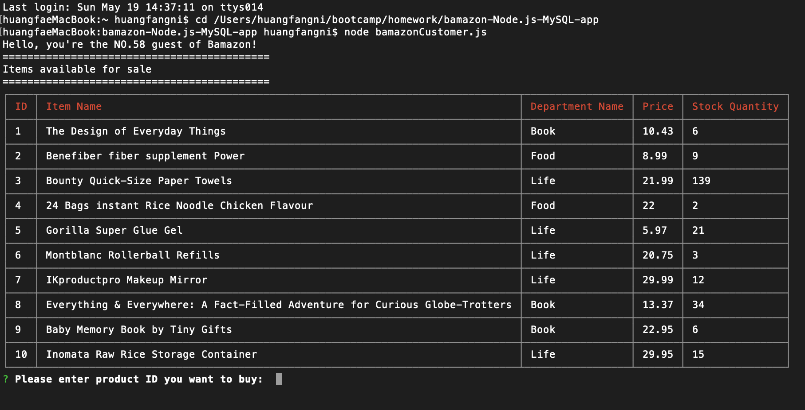

# bamazon-Node.js-MySQL-app

This is an Amazon-like storefront with MySQL skills I learned in Gatech Coding bootcamp. This is the 10th Assignment of Coding bootcamp.

**Node.js**
**MySQL**

## npm packages used in this app:

* [mysql](https://www.npmjs.com/package/mysql)

* [inquirer](https://www.npmjs.com/package/inquirer)

* [console.table](https://www.npmjs.com/package/console.table)

# Bamazon 
## Introduction:

### When the app starts, it will first display a table with 10 different products available for sale. 

    Then the user would be asked: what's the id of the product she or he would like to buy? How many?

    Once the user placed the order, Bamazon will check whether there're enough products stork.

### If not, 
     Bamazon will tell the user "Sorry, [the product] is out of stock!"

#### 3 seconds later, the table of all available products will be display once more, the user can make a new choice.

### If the store does have enough products, 
     Bamazon would show the total price that user should pay.
     Then, the stock_quantity of that product changes.

    